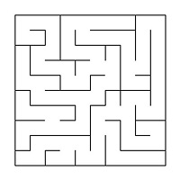
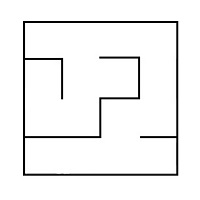
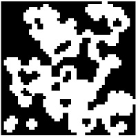

# Maze

Implementation of basic algorithms of maze and cave handling, such as: generation, rendering, solving.

## Information

A maze with "thin walls" is a table of _n_ rows by _m_ columns size. There may be "walls" between the cells of a table. The table as a whole is also surrounded by "walls".

The following is an example of such a maze: \


The solution to a maze is the shortest path from a given starting point (table cell) to the ending one.

When traversing a maze, you can move to neighboring cells that are not separated by a "wall" from the current cell and that are on the top, bottom, right or left.
A route is considered the shortest if it passes through the smallest number of cells.

An example of a maze with its solution:  \


In this example, the starting point is 10; 1, and the ending point is 6; 10.

## Maze description

The maze can be stored in a file as a number of rows and columns, as well as two matrices containing the positions of vertical and horizontal walls respectively.

The first matrix shows the wall to the right of each cell, and the second - the wall at the bottom.

An example of such a file:
```
4 4
0 0 0 1
1 0 1 1
0 1 0 1
0 0 0 1

1 0 1 0
0 0 1 0
1 1 0 1
1 1 1 1
```

The maze described in this file:  \


## Flaws in mazes

Maze flaws include isolated areas and loops.

An isolated area is a part of the maze with passages that you cannot access from the rest of the maze. For example: \


A loop is a part of the maze with passages that can be walked in "circles". The walls in the loops are not connected to the walls surrounding the maze. For example: \


## Generation using a cellular automaton

In many games there is a need for branching locations, such as caves.
They can be created by generation using the cellular automaton.
This kind of generation uses an idea similar to the Game of Life you are already familiar with. The idea of the proposed algorithm consists of implementing only two steps: first, the whole field is filled randomly with walls - i.e., for each cell it is randomly determined whether it will be free or impassable - and then the map state is updated several times according to the conditions, similar to the birth/death ones in the Game of Life.

The rules are simpler than in the Game of Life - there are two special variables, one for "birth" of "dead" cells (the "birth" limit) and one for destruction of "live" cells (the "death" limit).
If "live" cells are surrounded by "live" cells, the number of which is less than the "death" limit, they "die". In the same way, if "dead" cells are next to "live" cells, the number of which is greater than the "birth" limit, they become "live".

An example of the algorithm's result (the first picture shows only the initialized maze, and the second picture shows a maze in which there are no more changes in subsequent steps): \



## Caves description

A cave that has passed 0 simulation steps (only initialized) can be stored in the file as a number of rows and columns, as well as a matrix containing the positions of "live" and "dead" cells.

An example of such a file:
```
4 4
0 1 0 1
1 0 0 1
0 1 0 0
0 0 1 1
```

The cave described in this file: \


See materials for more examples of cave descriptions.


## Usage
Install the program by using Makefile target `install` or downloading project to a QtCreator application. 
App has such options:
1. Generating cave using a cellular automaton (or downloading it from a file).
2. Generating a perfect maze (or downloading it from a file).
3. Solving generated or downloaded maze
